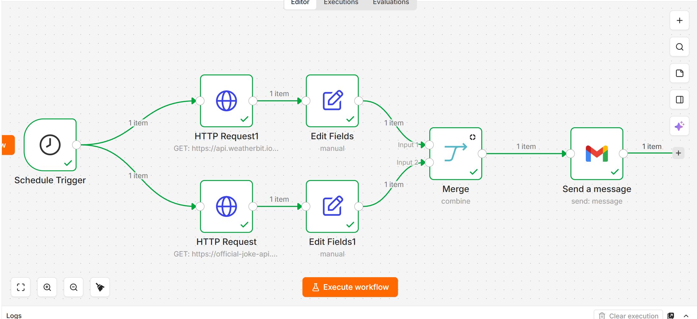
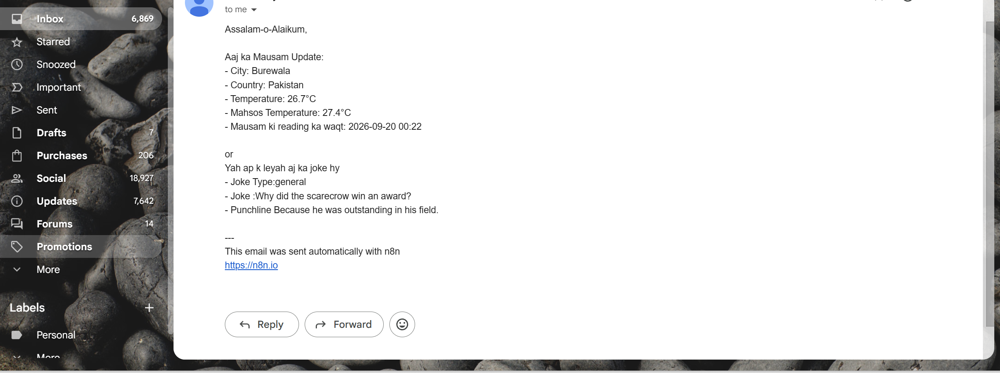

# Daily Weather & Joke Email

An n8n workflow that brings current weather and a random joke together in one email.

I built this project to practice working with two APIs, selecting useful fields, combining data, and sending scheduled emails.

## What it does

* Fetches current weather for a configured location using Weatherbit.
* Includes the temperature, feels-like temperature, and weather observation time.
* Fetches a random joke with its setup and punchline.
* Combines both responses into one plain-text email.
* Sends the email through Gmail.
* Is configured for a daily run at 8:00 AM in the Asia/Karachi timezone.

## Workflow preview

## How it works

The Schedule Trigger starts two branches:

1. **Weather branch:** An HTTP Request fetches current weather. An Edit Fields node selects the values used in the email.
2. **Joke branch:** Another HTTP Request fetches a random joke. Its Edit Fields node selects the joke type, setup, and punchline.

The Merge node combines the two branches. The Gmail node then sends one email containing both results.

The Merge node uses **Combine → All Possible Combinations**. With one item from each branch, it produces one combined item.

## Tools used

* n8n
* Schedule Trigger
* HTTP Request
* Edit Fields
* Merge
* Gmail
* Weatherbit API
* Official Joke API

This workflow uses field mappings and expressions; it does not require a Code node.

## Email preview

The email includes:

* City and country
* Temperature in °C
* Feels-like temperature in °C
* Weather observation time
* Joke type, setup, and punchline

The observation time comes from the weather response. It is not the time the email was sent.

## Setup

### 1. Import the workflow

Download `daily-weather-joke-email.json` and import it into n8n.

### 2. Configure Weatherbit

Open the weather node named **HTTP Request1**.

In its query parameters:

* Replace `YOUR_WEATHERBIT_API_KEY` with your own Weatherbit API key.
* Set `lat` and `lon` for your location.
* Keep `units` set to `M` for Celsius.

The example coordinates are configured for Burewala, Pakistan.

### 3. Check the location labels

In **Edit Fields**, the city and country labels are currently set to Burewala and Pakistan.

If you change the coordinates, update these labels too. Alternatively, map the city and country directly from the weather API response.

### 4. Configure Gmail

Open **Send a message**:

* Connect your own Gmail credential.
* Replace `your-email@example.com` with the intended recipient.
* Keep Email Type set to **Text**.
* Review the subject and message.

The shared workflow does not include a Gmail credential connection.

### 5. Check the schedule

The workflow is configured for:

* Frequency: daily
* Time: 8:00 AM
* Timezone: Asia/Karachi

Adjust the schedule and workflow timezone if needed.

### 6. Test and enable

Run the workflow manually and check the email in your inbox.

After confirming the result, publish or activate the workflow in your n8n version to enable scheduled runs.

For self-hosted n8n, the machine and n8n service must be running at the scheduled time.

## Testing completed

* Weather and joke data were retrieved during a manual run.
* Both branches were combined into one item.
* Gmail sent the email successfully.
* The received email was checked for the city, Celsius temperatures, observation time, joke, and punchline.

The daily schedule is configured. An automatic scheduled run has not yet been verified.

## Shared workflow

The exported file includes:

* A placeholder for the Weatherbit API key
* A placeholder recipient email address
* No Gmail credential reference
* No n8n instance metadata
* No pinned execution data
* An inactive workflow state

Add your own configuration before running it. Keep real API keys and credentials out of public repository files.

## Limitations

* This workflow reports current weather, not a daily forecast.
* City and country labels are currently fixed in Edit Fields.
* Random jokes may repeat; there is no duplicate tracking.
* If an API request fails, the workflow has no custom fallback email.
* It depends on API availability, account limits, and a working Gmail connection.
* Scheduled delivery requires n8n to remain running.

## What I learned

* How to fetch data from two APIs in separate branches
* How to select and map nested JSON fields
* How to combine responses into one email
* Why temperature units and workflow timezone matter
* How to test the actual email output
* How to prepare a workflow export for public sharing

